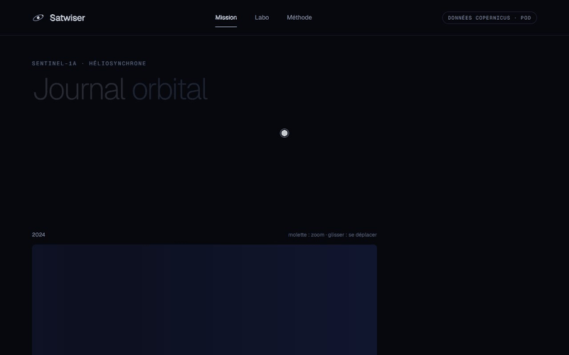
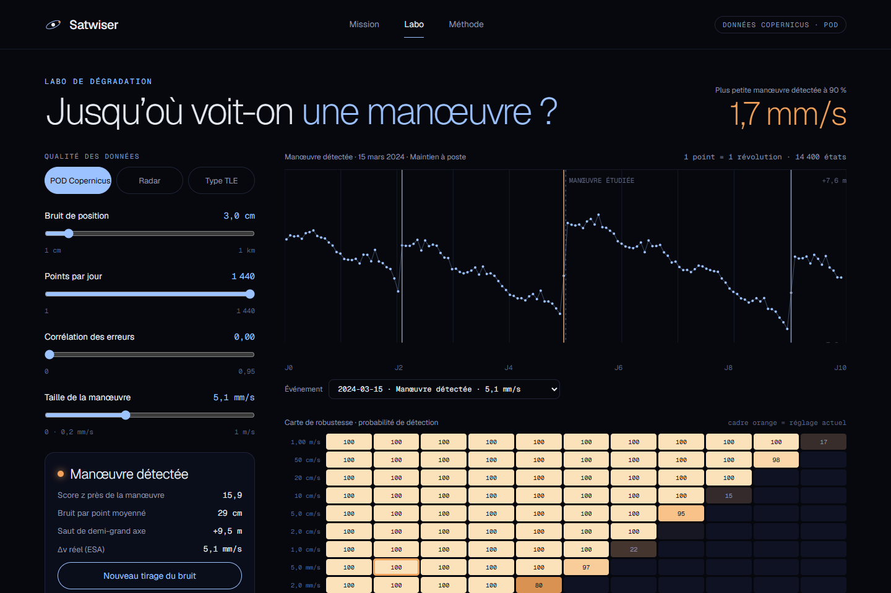
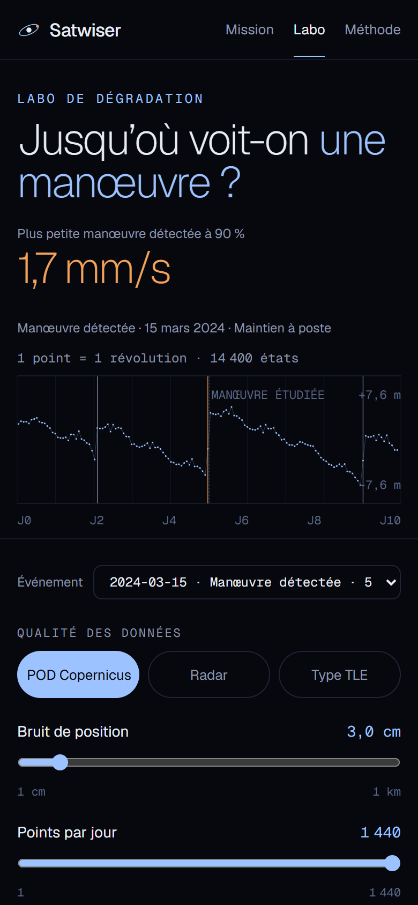
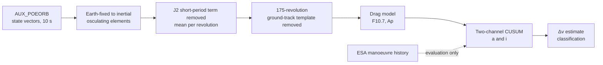
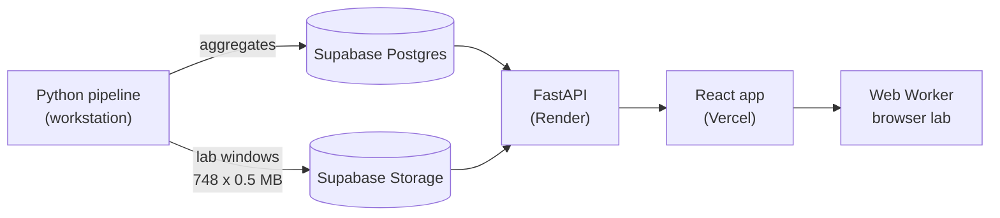

# Satwiser

**Detecting Sentinel-1 orbit manoeuvres from open precise orbits, classifying them, and
measuring how detection degrades when the orbit data get worse.**

**Live app: [satwiser.vercel.app](https://satwiser.vercel.app)** · API documentation:
[satwiser-api.onrender.com/docs](https://satwiser-api.onrender.com/docs) (free hosting:
the first request after a quiet period can take up to a minute)



Operators of low-Earth-orbit satellites raise their orbits regularly to compensate for
atmospheric drag. A third party watching the sky (a space-surveillance service, a
neighbouring operator) needs to spot these manoeuvres: an orbit that is not updated after
a manoeuvre degrades every prediction made from it, including collision-risk estimates.

Satwiser rebuilds the Sentinel-1A orbit history from the precise orbit products that
Copernicus publishes, detects manoeuvres with a causal change detector, checks the result
against the operator's own manoeuvre history, and then asks how small a manoeuvre can
still be seen when the data are noisier, sparser or correlated, from centimetre-level
precise orbits down to catalogue-like accuracy.

The interface is in French; the code, reports and this README are in English.

## Results

All numbers below come from the committed reports, which the scripts regenerate. Tuning
uses the calibration period only (2014-08-01 to 2020-01-01); results are reported on the
test period (2020-01-01 to 2026-06-13, the end of the ESA manoeuvre record), which spans
the 2024 solar maximum.

| Main detector, test period | Value |
|---|---|
| Recall (414 ESA manoeuvres) | **96.1 %** (398 detected) |
| Precision | **84.0 %** (76 false alarms) |
| F1 | 0.896 |
| Δv error on station-keeping manoeuvres (median) | 0.46 mm/s (10 %) |
| Detection delay (median, orbit time) | 3.3 h |

Comparison with the windowed baseline, on the same manoeuvres with the same evaluation
protocol ([`reports/step3/model.md`](reports/step3/model.md)):

| Detector | Test recall | Test precision | Test F1 | Causal |
|---|---|---|---|---|
| Baseline on the raw series (W = 6, z = 3) | 0.669 | 0.930 | 0.778 | no |
| Baseline on the template-corrected series (W = 12, z = 4) | 0.797 | 0.988 | 0.882 | no |
| **Template + drag model + CUSUM** | **0.961** | 0.840 | **0.896** | yes |

What made the difference:

- **Ground-track signature.** Sentinel-1 repeats its ground track every 175 revolutions
  (12 days). Most of what looked like revolution-to-revolution noise in the mean
  semi-major axis is a deterministic function of the position on that track
  (autocorrelation 0.995 at a lag of 175 revolutions). Removing a 175-value template
  fitted on calibration data brings the noise from **4.48 m to 0.20 m** in semi-major
  axis, and from 1.58 to 0.023 mdeg in inclination.
- **Drag model.** A power law of the solar flux and geomagnetic index predicts the decay
  between manoeuvres, including the 2024 solar maximum that lies outside the calibration
  range (predicted over observed mean 2024 decay: 0.95; an exponential law gives 1.83).
- **Causal two-channel CUSUM** on the semi-major axis and the inclination, so that
  out-of-plane manoeuvres, invisible in the semi-major axis, are caught too (57 of 57
  inclination manoeuvres detected on the test period).

Robustness ([`reports/step4/robustness.md`](reports/step4/robustness.md)): smallest
along-track Δv detected in 90 % of injected trials.

| Data quality (illustrative presets) | Noise | Samples per day | Smallest Δv at 90 % |
|---|---|---|---|
| Copernicus precise orbits | 3 cm | 8,640 | **0.94 mm/s** |
| Radar-like tracking | 30 m | 24 | 45.6 cm/s |
| TLE-like (Gaussian approximation) | 1 km | 2 | not reached below 1 m/s |

## The app

Three pages, all fed by the API; no number in the interface is typed in by hand.

- **Mission**: the mean semi-major axis over the whole mission, revolution by revolution,
  with every detected manoeuvre, missed manoeuvre and unlabelled detection. Zoom with the
  wheel or a pinch, pan by dragging, and pick an event to see its estimated Δv, jumps and
  ESA label.
- **Lab**: pick a real event and degrade the orbit data live in the browser (position
  noise, sampling, error correlation, manoeuvre size). A Web Worker re-runs the whole
  chain on ten days of real state vectors, and a precomputed grid shows the probability
  of detection for every noise level and Δv.
- **Method**: the method, the evaluation and its limits, with every figure read from the
  pipeline outputs.

<p>
  
  
</p>

The browser lab is a TypeScript port of the Python reference (`src/satwiser/lab.py`).
Both run on shared fixed-seed fixtures in the test suites and agree to 1e-5 m.

## Method



1. **Orbits.** 4,464 daily precise orbit files (26 h each, state vectors every 10 s,
   Earth-fixed frame) are rotated to a quasi-inertial frame and converted to orbital
   elements.
2. **Mean elements.** The first-order J2 short-period term is removed analytically, then
   the elements are averaged over each revolution (65,104 complete revolutions).
3. **Ground-track template.** A 175-value signature per element, estimated on quiet
   calibration periods only, is subtracted.
4. **Drag.** Between manoeuvres the semi-major axis decays at a rate modelled as
   `exp(b0) · F81^b1 · (F/F81)^b2 · (1+Ap)^b3`, where F is the daily F10.7 flux and F81
   its trailing 81-day mean, fitted on 233 quiet calibration segments.
5. **Detection.** A two-sided multichannel CUSUM compares each revolution with a
   prediction from the previous 20 revolutions of the same segment; innovations are
   clipped and scaled by a rolling robust noise estimate.
6. **Δv and class.** The jump is measured by straight-line fits on both sides of the
   change and converted with the Gauss equation (Δv = Δa · v / 2a). Each detection is
   classed as station keeping, orbit change or unexplained detection.
7. **Evaluation.** The ESA manoeuvre history is the ground truth: a detection within one
   revolution of a manoeuvre is correct, and repeated alarms on one manoeuvre count once.
8. **Degradation.** Precise states are degraded (orbit-like noise, AR(1) correlation,
   subsampling), manoeuvres of known Δv are injected into quiet ten-day windows, and a
   lighter windowed detector is re-run: 11 noise × 12 Δv × 7 sampling × 4 correlation
   levels, 60 trials per cell.

The precise orbit products flag the samples around each burn (`DEGRADED-MANOEUVRE`).
That flag is a label leak: it is used only to cross-check labels, never as a detector
input.

### Reports

Every figure and table is written by a script; the reports are the source of every
number in this README.

| Step | Report | Content |
|---|---|---|
| 1 | [`reports/step1/recon.md`](reports/step1/recon.md) | Data reconnaissance: sampling, overlaps, units of the ESA history, label leak |
| 2 | [`reports/step2/baseline.md`](reports/step2/baseline.md) | Per-revolution series and baseline detector |
| 3 | [`reports/step3/model.md`](reports/step3/model.md) | Template, drag model, CUSUM, comparison, ablations, classification |
| 4 | [`reports/step4/robustness.md`](reports/step4/robustness.md) | Degradation grid, presets, replay on real manoeuvres |
| – | [`reports/anomalies/anomalies.md`](reports/anomalies/anomalies.md) | Re-test of two known anomalies on the corrected series |
| – | [`reports/inputs.json`](reports/inputs.json) | Checksums of the external inputs behind the reports |

## Limitations

- **Calibration under a quiet Sun.** Settings are tuned on 2014–2019 (declining cycle
  and solar minimum). At the 2024 maximum the detector raises more false alarms: 27 of
  the 76 test false alarms fall within two days of a geomagnetic storm, which the daily
  drag model only partly captures. Without the drag model the test F1 would be higher
  (0.923 against 0.896, with recall 0.942); the choice was made on calibration data and
  is kept.
- **"Unexplained" is an operational class.** The ESA history has no anomaly class, so an
  unexplained detection is a detection without a matching ESA manoeuvre: drag effects,
  manoeuvres missing from the record or orbit-determination artefacts. The two known
  anomalies re-tested here (Sentinel-1A particle impact, August 2016; Sentinel-1B power
  anomaly, December 2021) leave no detectable orbital signature.
- **Classification.** A rule on the estimated jumps (test macro F1 0.752, accuracy
  0.830) and gradient-boosted trees (macro F1 0.757, accuracy 0.822) score almost the
  same on the test period; the app shows the rule. That choice was made after seeing the
  test scores, so it is not an out-of-sample model selection.
- **Delays exclude publication latency.** Detection delays are in orbit time; precise
  orbits are published about three weeks after the fact.
- **Presets are illustrative.** "Type TLE" is Gaussian orbit-like noise at TLE-like
  amplitude and cadence, not real SGP4 mean elements with their along-track errors.
- **Sparse-sampling floor.** Below about 144 samples per day, the short-period motion
  left by the first-order J2 correction sets a floor on the detectable Δv, whatever the
  noise. A sample-level ground-track template would remove most of it (residual RMS
  43.4 m to 3.1 m out of sample), but it relies on precise-orbit knowledge that a
  catalogue user would not have, so the presets do not use it.
- **Sentinel-1A only.** No manoeuvre history is published for Sentinel-1B, and
  Sentinel-1C has only been flying since December 2024.

## Architecture



| Part | Stack | Where |
|---|---|---|
| Pipeline | Python 3.12, NumPy, pandas, SciPy, numba, scikit-learn | `src/satwiser`, `scripts/` |
| API | FastAPI, SQLAlchemy Core (Postgres or local files), read-only | `backend/` |
| Front end | React 19, TypeScript, Vite, TanStack Query, d3-scale/shape, Web Worker | `frontend/` |
| Hosting | Supabase (Postgres with row-level security, Storage), Render, Vercel | `render.yaml`, `frontend/vercel.json` |

The API serves the precomputed aggregates and passes the compressed lab windows through
from object storage; no secret reaches the browser. A scheduled GitHub workflow pings
the API every three days so that the free Supabase project is not paused.

## Reproduce

### 1. Environment

```bash
conda env create -f environment.yml
conda activate satwiser
cp .env.example .env    # then set SATWISER_DATA_DIR to a folder outside the repository
```

Raw downloads and intermediate products go to `$SATWISER_DATA_DIR`, never into the
repository. The full Sentinel-1A precise orbit archive is about 2.7 GB compressed.

### 2. Data

```bash
python scripts/collect.py esa             # ESA manoeuvre history (SentiWiki)
python scripts/collect.py spaceweather    # F10.7 and Ap (GFZ Potsdam)
python scripts/collect.py poeorb --satellite S1A --start 2014-04-01 --end 2026-07-01
```

Precise orbits are read anonymously from the public `s1-orbits` AWS bucket: no account
is needed. The docstring of `scripts/recon_step1.py` lists the extra windows used by the
step 1 reconnaissance (including one Sentinel-1B window).

### 3. Pipeline

```bash
python scripts/build_series.py --satellite S1A     # per-revolution mean elements
python scripts/recon_step1.py                      # step 1 report
python scripts/run_baseline.py --satellite S1A     # step 2 report
python scripts/run_step3.py --satellite S1A        # step 3 report
python scripts/run_step4.py --satellite S1A        # step 4 report (lower --workers if memory is short)
python scripts/check_anomalies.py                  # known anomalies
python scripts/check_short_period_floor.py         # sparse-sampling floor diagnostic
python scripts/write_manifest.py --satellite S1A   # input checksums
python scripts/make_parity_fixtures.py             # Python/TypeScript lab fixtures
python scripts/export_app_data.py --satellite S1A  # data served by the API
```

### 4. App, locally

```bash
uvicorn satwiser_api.main:app --reload --app-dir backend   # reads $SATWISER_DATA_DIR/app
cd frontend && npm install && npm run dev                    # http://localhost:5173
```

In development Vite proxies `/api` to the local API on port 8000; in production
`VITE_API_URL` points to the hosted API.

### 5. Tests

```bash
ruff check .
pytest                                    # pipeline and API
cd frontend && npm test && npm run typecheck
```

### 6. Deployment

1. Load the database: set `DATABASE_URL` (Supabase session pooler,
   `postgresql+psycopg://...`) and run `python backend/scripts/load_database.py`.
2. Upload the lab windows: set `SUPABASE_URL` and `SUPABASE_SERVICE_KEY` and run
   `python backend/scripts/upload_lab_windows.py`.
3. Deploy the API on Render from `render.yaml`, with `DATABASE_URL`,
   `SATWISER_LAB_STORAGE_URL` and `CORS_ORIGINS` set as secrets.
4. Deploy the front end on Vercel with root directory `frontend` and `VITE_API_URL`
   pointing to the API.
5. Add the repository secret `API_HEALTH_URL` for the keep-alive workflow.

All variables are listed in [`.env.example`](.env.example).

## Repository layout

```
src/satwiser/       pipeline package
  collect/          downloads (precise orbits, ESA history, space weather)
  io/, orbit/       file readers, frames, orbital elements
  pipeline/         per-revolution series
  model/            ground-track template, drag model
  detection/        baseline detector, CUSUM
  evaluation.py     matching against the ESA history, metrics
  classify.py       event classes
  lab.py            degradation lab (reference for the browser port)
scripts/            one script per step, each writing its report
reports/            generated reports and figures
backend/            FastAPI service, database loader, deployment scripts
frontend/           React app and browser lab
tests/              pipeline tests
docs/screenshots/   images used in this README
```

## Data and attribution

- **Copernicus Sentinel-1 precise orbits (AUX_POEORB)** and **manoeuvre history**,
  European Space Agency. Contains modified Copernicus Sentinel data 2014–2026.
- **F10.7 and Ap indices**: GFZ German Research Centre for Geosciences, Potsdam
  (CC BY 4.0). The sunspot-number column, under a non-commercial licence, is not used.

Related project: [False Calm Detector](https://github.com/victorvb22/false-calm-detector)
looks at the next link of the chain, from an updated orbit to collision-risk triage.
